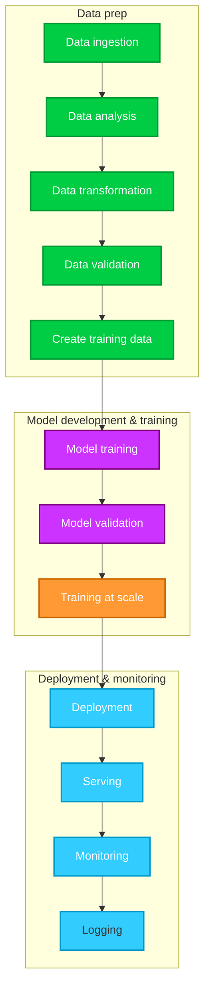

# SEANERGYS-MLOps

## 🔍 1. What is MLOps?

**MLOps (Machine Learning Operations)** is the set of **tools, processes, and practices** that make it possible to **develop, deploy, monitor, and continuously improve** machine learning (ML) models in production — **just like DevOps**, but extended for the entire **ML lifecycle**.

In **SEANERGYS**, MLOps underpins the **AIDAS Model Zoo** and ensures:

- Reproducibility of training and testing.  
- Automated deployment to cloud + HPC environments.  
- Version control for datasets and models.  
- Continuous retraining and monitoring.  
- Integration with the CI/CD (WP5) system.
---

---

## 🧩 2. Core Components of MLOps

| Layer | Component | Description | Typical Tools |
| --- | --- | --- | --- |
| **1️⃣ Data & Feature Layer** | **Data Versioning** | Track dataset versions, metadata, schema evolution | DVC, Git-LFS, Delta Lake |
|  | **Data Validation** | Check data quality, drift, missing values | Great Expectations, TFDV |
| **2️⃣ Model Layer** | **Experiment Tracking** | Record hyperparameters, metrics, and artifacts | MLflow |
|  | **Model Registry / Zoo** | Store and version trained models; approval workflow | MLflow Registry, GitLab Packages |
| **3️⃣ Pipeline Layer** | **Training Pipelines** | Automated scripts for training and evaluation | Kubeflow, Airflow, GitLab CI |
|  | **Testing / Validation** | Unit, integration, performance, fairness, and energy tests | Pytest, tox, custom scripts |
| **4️⃣ Deployment Layer** | **Serving & Inference** | Package model in container and deploy to API/service | Docker, FastAPI, TorchServe |
|  | **Monitoring** | Track accuracy, drift, latency, resource usage | Prometheus, Grafana, Evidently |
| **5️⃣ Ops Layer** | **CI/CD Integration** | Automated build, test, deploy cycles | GitLab CI/CD, Jenkins |
|  | **Governance & Reproducibility** | Ensure traceability of data, code, model, metrics | Git, model cards, provenance DB |

> 🧠 For **LLM models**, we must rethink Layers **2–5** (model registry, training, serving, and CI/CD) due to model size, context storage, and prompt management.

---

## 🧱 3. Functional Requirements

Based on **industry standards** (NIST, ISO/IEC 23053:2022) and the **SEANERGYS Grant Agreement**, MLOps must satisfy:

| Category | Requirement | Meaning for SEANERGYS |
| --- | --- | --- |
| **Reproducibility** | Every model training must be fully reproducible (same code, data, and seed produce same result) | Store code + data + config in GitLab with commit hash |
| **Traceability** | Every dataset and model must have a unique identifier and metadata | Version datasets and models (e.g., GitLab + MLflow + DVC) |
| **Automation** | Model retraining, validation, and deployment integrated into CI/CD pipelines | GitLab pipelines triggering retraining/testing |
| **Validation** | Automated evaluation (accuracy, precision, energy usage, etc.) | WP5 Verification Suite |
| **Monitoring** | Continuous performance and drift monitoring in production | Grafana dashboards |
| **Scalability** | Works across HPC and cloud | Container-based, GPU/CPU aware |
| **Security & Compliance** | Secure data access and role-based controls | RBAC, Vault secrets in GitLab/K8s |
| **Feedback Loop** | Human-in-the-loop validation and update mechanism | AIDAS visualization toolkit integration |

---

## ⚙️ 4. Technical Requirements (System / Infrastructure Level)

| Layer | Minimum Requirement | HPC/Cloud Setup Example |
| --- | --- | --- |
| **Compute** | GPU-enabled or CPU cluster nodes for training and inference | Cloud + HPC nodes |
| **Storage** | Persistent storage for datasets and model artifacts | CephFS, NFS, or object store (MinIO, S3) |
| **Containerization** | Image registry and runtime | Docker / Podman + GitLab Container Registry |
| **CI/CD Runner** | Runner with Python + ML frameworks preinstalled | GitLab Runner with ML executor |
| **Version Control** | Code + data repository | GitLab Projects with DVC integration |
| **Monitoring Stack** | Metrics collection and visualization | Prometheus + Grafana dashboards |
| **Orchestration** | Automated pipeline scheduling and management | Kubernetes / Kubeflow / GitLab pipelines / HPC schedulers |

---

## 🪶 5. Minimum Viable MLOps (MVP)

A **functional but lightweight MLOps setup** — ideal for **WP3 (AIDAS)** and **WP5 integration** — includes:

| Layer | Component | Example Tool / Implementation |
| --- | --- | --- |
| **Code Repository** | Version control for code + notebooks | GitLab |
| **Data Management** | Versioned datasets | DVC with remote storage |
| **Experiment Tracking** | Track model metrics and hyperparameters | MLflow (local or containerized) |
| **Model Registry** | Store and tag models | MLflow Registry / GitLab Packages |
| **Pipeline Automation** | Automated build–train–test–deploy | GitLab CI/CD YAML |
| **Containerization** | Build deployable images | Docker / Podman |
| **Deployment** | Serve models as APIs | FastAPI / Flask containers |
| **Monitoring** | Logs + metrics dashboards | Prometheus + Grafana |

---
## 🧠 6. In SEANERGYS Context (UniBO Perspective)

Minimum required deliverables and components for UniBO:

1. **GitLab-based pipeline** with ML stages:
    - `data_prep`, `train`, `validate`, `package`, `deploy`, `monitor`
2. **Model Zoo** connected to the CI/CD artifact registry (versioned models)
3. **MLflow or equivalent** for tracking experiments
4. **Prometheus metrics exporter** for deployed models
5. **Container-based deployment templates** for HPC (Singularity/Apptainer or Docker)
6. **Basic dashboards** for performance + energy KPIs
7. **Documented workflow** for retraining and revalidation (→ D3.1 and D3.3)

---
+----------------------------------------------------------------------------------------------+
|                                        WP2 - CMI                                             |
|                      Telemetry (jobs, nodes, facility) -> unified formats/APIs               |
+----------------------------------------------------------------------------------------------+
                                            |
                                            |  (Ingest / Day0 & cross-site datasets)
                                            v
+----------------------------------------------------------------------------------------------+
|                         WP3 - AIDAS (Model Zoo + AI Production)                              |
|                                                                                              |
|  [Data & Features]      [Training]                    [Evaluation]         [Registry / Zoo]  |
|  - DVC & schema checks  - CPU/GPU train scripts       - Metrics & drift    -MLflow registry  |
|  - Sample sets & splits - Repro seeds, HP search      - Cost/benefit       -Artifacts/weights|
|  - Day0 & cross-site    - (FL/TL later)               - Bake-off criteria  - Model cards/IDs |
|                                                                                              |
|  [Serving & Monitoring/Feedback]                                                             |
|  - FastAPI/TorchServe/LLM endpoints -> Prometheus/Grafana + user dashboards + bake-off fbk   |
+----------------------------------------------------------------------------------------------+
              ^                                    |
              |                                    | models + reports (tagged)
              |                                    v
+----------------------------------------------------------------------------------------------+
|                                WP5 - CI/CD & QA                                              |
|  GitLab: code, issues, runners, artifacts; end-to-end traceability                           |
|  Pipelines: lint -> unit -> train -> eval -> package -> deploy -> smoke                      |
|  Verification suite & tests (functional, performance, energy)                                |
+----------------------------------------------------------------------------------------------+
                                            |
                                            | deployment bundles (containers/Helm)
                                            v
+----------------------------------------------------------------------------------------------+
|                           WP6 - Hosting Sites (deployment)                                   |
|  Staged rollout on HS test/prod systems; acceptance tests; best-practice guide               |
+----------------------------------------------------------------------------------------------+

---

